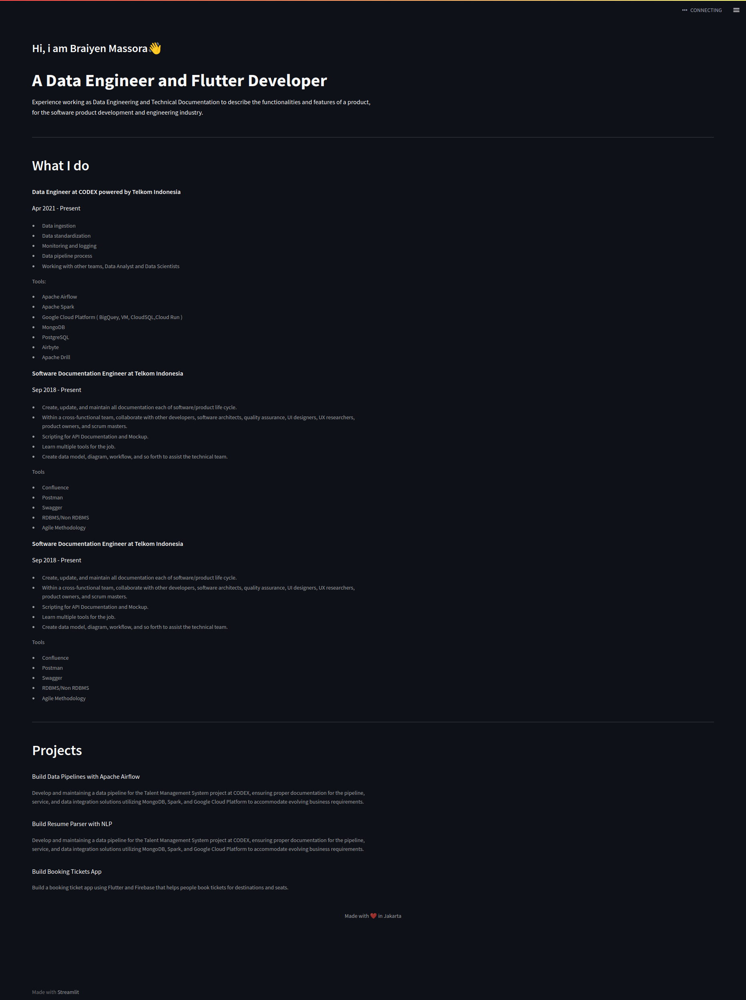

# Streamlit Resume Blog

This is a Streamlit project that allows you to create a resume blog using Streamlit, a popular Python library for building interactive web applications.

## Features

- This project was inspired by the need for a simple yet customizable resume blog.
- Support for various sections in a resume: professional information, "What I do," and projects.


## Run Locally

Clone the project

```bash
  git clone https://github.com/braiyenmassora/streamlit-resume-blog.git
```

Go to the project directory

```bash
  cd streamlit-resume-blog
```

Activate virtual environment

```bash
   source  streamlit-resume-blog/bin/activate
```

Install dependencies

```bash
   pip install -r requirements.txt

```

Start the server
```bash
  cd streamlit-resume-blog
  cd src
  streamlit run app.py
```

Access Server on Chrome or Firefox
```bash
  http://localhost:8501/
```


## Usage/Examples

```bash
You can customize the content in the app.py file according to your needs.
```
## Screenshots


